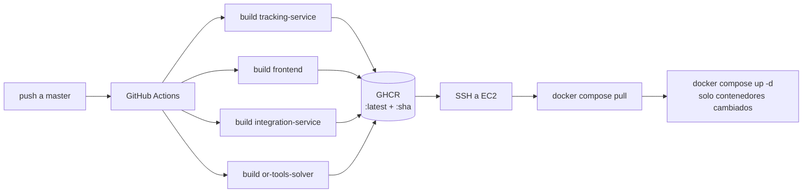

# Despliegue: Integración, Entorno de Producción, CI/CD y Hosting

Documentación del despliegue del sistema de rastreo vehicular en la nube.
Se organiza en cuatro capítulos: **Integración** (cómo se conectan los
componentes y los sistemas externos), **Entorno de producción** (la
configuración que difiere del desarrollo), **CI/CD** (el pipeline de
integración y despliegue continuos) y **Hosting** (la selección del proveedor,
el aprovisionamiento y el análisis de costos).

---

## 1. Integración

### 1.1 Integración interna: cómo se conectan los componentes

El sistema desplegado consta de 14 contenedores orquestados por Docker Compose
sobre una red bridge privada (`tracking-net`). Los servicios se descubren entre
sí por nombre DNS de Docker (`kafka`, `cache-db`, `redis`…), de modo que la
topología interna es idéntica en desarrollo y en producción — una propiedad
clave: lo que se prueba localmente es lo que corre en la nube.

Flujos de integración principales:

| Flujo | Camino |
|---|---|
| Posiciones GPS | Teléfono → Traccar `:5055` (protocolo OsmAnd) → webhook JSON → `tracking-service /api/traccar/positions` (autenticado con `x-api-key`) → enriquecimiento → Redis + PostgreSQL + TimescaleDB + Kafka (`gps.positions.enriched`) → WebSocket al dashboard |
| Datos de negocio | `POST /api/customers` → Kafka `commands.*` → `integration-service` → MySQL → Debezium CDC → tópicos `cdc.*` → caché PostgreSQL |
| Ruteo | `tracking-service` → OSRM (matriz de distancias) → OR-Tools (solver VRP) |
| Dashboard | Navegador → nginx `:80` (SPA) + API REST/Socket.io `:3000` |

### 1.2 Integración con sistemas externos

**Traccar (servidor GPS).** Es la frontera de entrada del mundo físico. Dos
integraciones: (a) los teléfonos le reportan por el protocolo OsmAnd en el
puerto público 5055; (b) Traccar reenvía cada posición y evento al backend por
webhook (`forward.url`), autenticado con la cabecera compartida `x-api-key`.
El contrato central es `Traccar uniqueId ≡ drivers.device_id`: el
enriquecimiento resuelve el conductor por ese identificador.

**App iOS de conductores.** Envía posiciones por OsmAnd al puerto 5055 y
consume la API REST en el 3000. Al no haber TLS en esta fase, el build de
desarrollo iOS requiere una excepción ATS (App Transport Security).

**Lección de integración aprendida en el primer despliegue.** Traccar 6 no
crea ningún usuario administrador en una base de datos nueva. En local ese
usuario existía de un registro manual antiguo; en la nube la tabla `tc_users`
estaba vacía, el aprovisionamiento de dispositivos no podía autenticarse y
cada posición era rechazada con HTTP 400. La corrección (commit `c9b2f39`)
hizo el sistema **auto-reparable**:

1. `TraccarAdminService`: ante un 401, se auto-registra como primer usuario de
   Traccar (que recibe rol de administrador) y reintenta la operación.
2. `DriversService.onModuleInit`: al arrancar, encola un `ensure` idempotente
   por cada conductor activo con `device_id`, a través de la cola BullMQ
   existente (reintentos con backoff exponencial ≈ 4 min, tolerando que
   Traccar aún esté arrancando).

Verificación destructiva: se eliminaron el administrador y todos los
dispositivos de Traccar; un reinicio del backend reconstruyó todo sin
intervención (admin + 3 dispositivos, subidas HTTP 200). Un despliegue desde
cero ya no requiere ningún paso manual en Traccar.

---

## 2. Entorno de producción

### 2.1 Principio: mismo stack, distinta piel

El entorno de producción no re-arquitectura nada: aplica un *override* de
Compose (`docker-compose.prod.yml`) sobre el archivo base. Diferencias
respecto a desarrollo:

| Aspecto | Desarrollo | Producción |
|---|---|---|
| Imágenes propias | `build:` local | `image:` desde GHCR (mismo tag: `build` y `pull` son intercambiables) |
| `NODE_ENV` | development | production |
| Frontend | Vite dev server (`:3001`) | bundle estático servido por nginx (`:80`) |
| Puertos internos (MySQL, PostgreSQL, TimescaleDB, Redis, Kafka, Kafka UI/Connect, OR-Tools, OSRM) | publicados al host | re-ligados a `127.0.0.1` con `!override` |
| `JWT_SECRET` | valor por defecto | aleatorio de 64 hex (el backend **rehúsa arrancar** en producción con el valor por defecto) |
| CORS | localhost permisivo | solo el origen real del dashboard |
| Logging | debug | info, a disco con rotación (pino-roll) |

### 2.2 Configuración (`.env` de producción)

Generado una sola vez por `deploy/aws/bootstrap-server.sh` y persistido en el
servidor (`/opt/tracking/.env`); nunca pasa por el repositorio ni por el
pipeline. Ajusta: `NODE_ENV`, `JWT_SECRET`, `CORS_ORIGINS`, `FRONTEND_PORT=80`
y las URLs `VITE_*` apuntando a la Elastic IP.

Caso especial: `VITE_API_URL`/`VITE_WS_URL` **no son configuración de
runtime** — Vite las hornea en el bundle en tiempo de build. Por eso existen
dos veces: en el `.env` del servidor (para builds locales de emergencia) y
como variables del repositorio GitHub (para los builds del pipeline).

### 2.3 Superficie de red

| Puerto | Servicio | Exposición |
|---|---|---|
| 80 | Dashboard | Público |
| 3000 | API REST + WebSocket | Público |
| 5055 | Ingesta GPS (OsmAnd) | Público |
| 22 | SSH (solo autenticación por clave) | Público (requerido por los runners de CI; contraseñas deshabilitadas) |
| 8082 | Interfaz web de Traccar | Solo IP del administrador |
| resto | bases de datos y servicios internos | `127.0.0.1` + security group |

Defensa en profundidad: aunque el security group ya bloquea los puertos
internos, el override los re-liga a localhost — dos capas independientes.

Limitaciones aceptadas en esta fase (prueba de campo de 3 días) y su plan:
HTTP sin TLS (→ Caddy + dominio con Let's Encrypt), SSH abierto para CI
(→ despliegue vía AWS SSM sin puerto entrante), credenciales por defecto en
bases de datos (→ inaccesibles desde Internet; rotación al pasar a demo
persistente).

### 2.4 Datos y persistencia

Todos los volúmenes Docker (MySQL, PostgreSQL, TimescaleDB, Kafka, Redis,
Traccar) viven en el disco EBS de 80 GB. Detener la instancia **no** pierde
datos; el historial GPS se acumula entre sesiones de prueba, útil para probar
playback y reportes con datos reales de varios días. Respaldo: snapshots EBS
bajo demanda antes de un teardown.

---

## 3. CI/CD

### 3.1 Diseño

Principio: **el servidor nunca compila; solo descarga y ejecuta.** Los runners
de GitHub construyen; GitHub Container Registry (GHCR) almacena; la instancia
hace `pull` y reemplaza contenedores. Los contenedores de infraestructura
(Kafka, bases de datos, Traccar, OSRM) no participan: un deploy intercambia
solo los 4 servicios propios, sin tocar datos ni estado.



Ventajas medidas: los 16 GB del servidor quedan íntegros para la aplicación
(compilar 4 imágenes junto a Kafka y 4 bases de datos podría provocar OOM);
un build roto falla en GitHub y nunca toca el servidor; cada imagen queda
etiquetada por commit (`:sha`), de modo que el rollback es re-desplegar un
tag anterior, sin recompilar.

### 3.2 Job `build`

- **Matriz de 4 imágenes** en paralelo: `tracking-service` (target
  `production`), `frontend`, `integration-service`, `or-tools-solver`.
- **Doble etiqueta:** `:latest` (la que sigue el servidor) y `:<sha>`
  (auditoría + rollback).
- **Caché de capas** (`type=gha`, un scope por servicio): primer build ~8 min;
  siguientes ~2–3 min (las capas de `npm install` se reutilizan).
- **Autenticación a GHCR** con el `GITHUB_TOKEN` automático del workflow.
- Build args del frontend inyectados desde variables del repositorio
  (sección 2.2).

### 3.3 Job `deploy`

Con `needs: build` (solo corre si las 4 imágenes publicaron). Por SSH:

```bash
cd /opt/tracking
git fetch origin master && git reset --hard origin/master
docker compose -f docker-compose.yml -f docker-compose.prod.yml --profile full pull
docker compose -f docker-compose.yml -f docker-compose.prod.yml --profile full up -d --remove-orphans
docker image prune -f
```

Compose reemplaza únicamente los contenedores cuya imagen cambió: el deploy
típico toma ~30 segundos con el stack caliente.

### 3.4 Configuración en GitHub y manejo de secretos

| Tipo | Nombre | Contenido |
|---|---|---|
| Secret | `EC2_HOST` | Elastic IP |
| Secret | `EC2_SSH_KEY` | clave privada SSH del despliegue |
| Variable | `VITE_API_URL` / `VITE_WS_URL` | `http://<elastic-ip>:3000` |

Los paquetes GHCR se marcan públicos para que el servidor haga `pull` sin
credenciales. Inventario de secretos resultante: GitHub solo conoce el acceso
al servidor; los secretos de aplicación viven únicamente en el `.env` del
servidor; el repositorio no contiene ninguno.

### 3.5 Problemas encontrados y sus correcciones

1. **`dial tcp :22: i/o timeout`** — el security group solo permitía SSH desde
   la IP del administrador, pero los runners de GitHub conectan desde IPs
   dinámicas de su nube. Corrección: abrir 22 a `0.0.0.0/0` (autenticación
   exclusivamente por clave; las contraseñas están deshabilitadas en Ubuntu).
   Alternativa más estricta documentada como trabajo futuro: despliegue vía
   AWS SSM, sin ningún puerto entrante.
2. **`script_stop` inválido** — input obsoleto en `appleboy/ssh-action@v1`;
   eliminado del workflow.
3. **Primer run con deploy fallido por diseño** — los secretos aún no
   existían; el pipeline degradó exactamente como se esperaba: builds
   exitosos, deploy fallido, servidor intacto.

### 3.6 Verificación de punta a punta

Tras el run verde: los 4 contenedores reportan imágenes
`ghcr.io/sergio-al/nest-react-cdc-map-tracking/*:latest`; el bundle del
frontend servido contiene la URL de producción horneada; `GET /api/health`
responde `ok` con Kafka, Redis y TimescaleDB arriba. Desde entonces el ciclo
de trabajo es: `git push origin master` → ~3 minutos → cambio en vivo.

---

## 4. Hosting

### 4.1 Selección del proveedor

Se compararon tres proveedores para un host único con Docker:

| Criterio | Hetzner | DigitalOcean | **AWS (elegido)** |
|---|---|---|---|
| Costo bruto (16 GB) | ~€28/mes (el más barato) | ~US$ 96/mes | ~US$ 195/mes en sa-east-1 |
| Costo efectivo | €7/semana | crédito de bienvenida US$ 200 | **US$ 0 — créditos promocionales (~US$ 159)** |
| Región Sudamérica | ✖ (EE. UU./Europa) | ✖ (EE. UU. más cercano) | ✔ São Paulo (~40–70 ms desde Bolivia) |
| Fricción de alta | verificación de identidad | inmediata | cuenta ya existente |

La decisión no fue "AWS es más barato" — no lo es — sino que los créditos
promocionales disponibles hacían el costo real cero **y** era el único
proveedor con región sudamericana, decisivo para la latencia del dashboard en
tiempo real. Con créditos de DigitalOcean disponibles y sin requisito de
latencia, la respuesta habría sido distinta: la elección de hosting es un
cálculo de costo efectivo + latencia, no una preferencia de marca.

Dentro de AWS se evaluó también el estilo de despliegue: EC2 plano contra
ECS/Fargate y servicios administrados (MSK, RDS). Se eligió EC2 porque el
stack es mayormente *stateful* (Kafka + 4 bases de datos), el repositorio ya
es un artefacto de despliegue para un solo host, y la descomposición en
servicios administrados multiplicaría el costo ~5–10× pagando alta
disponibilidad que una prueba de campo no necesita (además, TimescaleDB no
existe en RDS).

### 4.2 Dimensionamiento

- **`t3.xlarge`** (4 vCPU, 16 GB): los procesos JVM (Kafka, Kafka Connect,
  Traccar) suman 3–4 GB; las cuatro bases de datos, ~3 GB; margen para builds
  de emergencia y picos de enriquecimiento.
- **x86 y no Graviton/ARM** (que ahorraría 20–40 %): la imagen oficial
  `osrm/osrm-backend` no publica variante arm64. Documentado como optimización
  futura.
- **Disco gp3 de 80 GB**: sistema + imágenes + volúmenes + datos OSRM de
  La Paz (~1 GB procesado).

### 4.3 Aprovisionamiento

Scripts CLI idempotentes y etiquetados (`Project=tracking-demo`), sin estado
externo:

- `provision.sh`: AMI Ubuntu 24.04 resuelta vía SSM Parameter Store, key
  pair, security group con las reglas de la sección 2.3, instancia con
  user-data (instala Docker Engine + Compose v2 del repositorio oficial),
  Elastic IP asociada.
- `first-deploy.sh` + `bootstrap-server.sh`: sincronización del árbol con
  `rsync`, `.env` de producción, descarga y preprocesamiento de los datos
  OSRM (Geofabrik → recorte a La Paz → extract/partition/customize), build
  inicial y arranque con verificación de salud.
- `teardown.sh`: destrucción completa (instancia, EIP, SG, key pair) — la
  garantía de que el experimento no deja facturación residual.

Trabajo futuro: portar estos scripts a AWS CDK, con lo que el entorno queda
versionado como stack de CloudFormation y `cdk destroy` reemplaza a
`teardown.sh`.

### 4.4 Análisis de costos

Tarifas `sa-east-1`, agosto 2026, bajo demanda:

| Concepto | Tarifa | Por día (24 h) |
|---|---|---|
| EC2 `t3.xlarge` | ~US$ 0,27/h | ~US$ 6,45 |
| EBS gp3 80 GB | ~US$ 0,19/GB-mes | ~US$ 0,50 |
| IPv4 pública | US$ 0,005/h | ~US$ 0,12 |
| Transferencia de salida | ~100 GB/mes gratis | ~US$ 0 |
| **Encendido 24 h** | | **~US$ 7,10/día** |
| **En pausa** (disco + IP) | | **~US$ 0,75/día** |

| Escenario | Costo estimado |
|---|---|
| Prueba de campo de 3 días (24/7) | ~US$ 21 |
| 3 días, encendido 12 h/día | ~US$ 12 |
| Demo de 1 semana (24/7) | ~US$ 50 |
| 1 semana on + 2 en pausa + 1 semana on | ~US$ 77 |

El patrón operativo elegido — **encender para las sesiones de prueba, pausar
entre ellas** — convierte los ~US$ 159 de créditos en ~700 horas de ejecución:
un mes continuo, o varios meses de pruebas intermitentes. El pipeline CI/CD
tiene costo cero (GitHub Actions en repositorio público + GHCR).

### 4.5 Operación

```bash
# pausar / reanudar entre sesiones (la Elastic IP no cambia)
aws ec2 stop-instances  --instance-ids <id> --profile personal --region sa-east-1
aws ec2 start-instances --instance-ids <id> --profile personal --region sa-east-1

# acceso y logs
ssh -i ~/.ssh/tracking-demo-key.pem ubuntu@<elastic-ip>
docker compose -f docker-compose.yml -f docker-compose.prod.yml --profile full logs -f

# fin del experimento
./deploy/aws/teardown.sh
```

Al reiniciar, `restart: unless-stopped` levanta todos los contenedores sin
intervención. Monitoreo de gasto: presupuesto en AWS Budgets con alerta sobre
gasto real post-créditos, y Cost Explorer con granularidad diaria.

### 4.6 Evolución del hosting

| Disparador | Cambio |
|---|---|
| Demo persistente / usuarios reales | TLS (Caddy + dominio), frontend a S3 + CloudFront, rotación de credenciales |
| Clientes cuya pérdida de datos = churn | PostgreSQL → RDS single-AZ; Kafka y Timescale siguen auto-gestionados |
| Tenants sin integración ERP | Modo standalone-PostgreSQL: colapsar MySQL + Kafka + CDC en un solo PostgreSQL (extensión Timescale) → requisito de RAM de 16 GB a ~4 GB (`t4g.medium`, ~US$ 18/mes) — la mayor palanca de optimización identificada |
| Todas las imágenes con variante arm64 | Migración a Graviton (−20–40 % de cómputo) |
