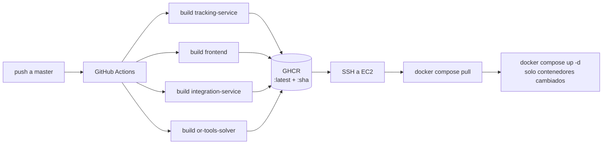

# Despliegue en la nube y pipeline CI/CD

Documentación del despliegue del sistema de rastreo vehicular en AWS y de su
pipeline de integración y despliegue continuos (CI/CD). Cubre la decisión de
arquitectura, el aprovisionamiento de infraestructura, el flujo de despliegue,
la operación diaria y el análisis de costos.

---

## 1. Contexto y objetivos

El sistema completo (14 contenedores: Kafka, Debezium, MySQL, PostgreSQL,
TimescaleDB, Redis, OSRM, OR-Tools, Traccar y los servicios propios) ya se
orquesta localmente con Docker Compose mediante el perfil `full`. El objetivo
del despliegue fue exponer ese mismo stack en Internet para:

- Pruebas de campo con dispositivos reales (app iOS de conductores y clientes
  Traccar enviando posiciones GPS por el protocolo OsmAnd).
- Acceso al dashboard en vivo desde cualquier navegador.
- Un pipeline CI/CD que reconstruya y despliegue automáticamente los servicios
  propios en cada push a `master`.

Restricción principal: **costo mínimo**, financiado con créditos promocionales
de AWS (~US$ 159 disponibles).

## 2. Decisión de arquitectura

### 2.1 Alternativas evaluadas

| Alternativa | Evaluación |
|---|---|
| **Una instancia EC2 con Docker Compose** | ✅ Elegida. El repositorio ya es un artefacto de despliegue para un solo host; costo ~US$ 0,27/h. |
| ECS / Fargate | Descartada: el stack es mayormente *stateful* (Kafka, 4 bases de datos); Fargate exige volúmenes EFS, task definitions por servicio y service discovery — semanas de trabajo y mayor costo para una demo. |
| Servicios administrados (MSK, RDS, ElastiCache) | Descartada para esta fase: MSK exige mínimo 2 brokers (~US$ 150+/sem), TimescaleDB no existe en RDS, y el premium de precio paga alta disponibilidad que una prueba de campo no necesita. |
| Kubernetes (EKS) | Descartada: complejidad y costo desproporcionados a la escala actual. |

### 2.2 Arquitectura desplegada

```
                        Internet
                           │
              Elastic IP (52.67.163.132)
                           │
        ┌──────────────────┴───────────────────┐
        │  EC2 t3.xlarge — Ubuntu 24.04        │
        │  (sa-east-1, São Paulo, 80 GB gp3)   │
        │                                      │
        │  Docker Compose (--profile full)     │
        │  ├── frontend (nginx)          :80   │
        │  ├── tracking-service (NestJS) :3000 │
        │  ├── traccar (ingesta GPS)     :5055 │
        │  ├── traccar UI                :8082 │ ← solo IP admin
        │  ├── kafka + kafka-connect  (interno)│
        │  ├── mysql · cache-db · timescale    │
        │  ├── redis · osrm · or-tools         │
        │  └── integration-service    (interno)│
        └──────────────────────────────────────┘
```

Decisiones clave:

- **Región `sa-east-1` (São Paulo):** único datacenter sudamericano entre los
  proveedores evaluados; ~40–70 ms de latencia desde Bolivia contra ~100 ms
  desde us-east. Prioridad a la experiencia del dashboard en vivo.
- **Instancia x86 (`t3.xlarge`, 4 vCPU / 16 GB):** se descartó Graviton (ARM,
  ~20 % más barato) porque la imagen oficial `osrm/osrm-backend` no publica
  variante arm64.
- **Elastic IP:** dirección estable que sobrevive a los ciclos stop/start de la
  instancia, de modo que la configuración de la app iOS y de los clientes
  Traccar nunca cambia.
- **Los datos viven en el disco EBS:** detener la instancia entre sesiones de
  prueba conserva todas las bases de datos y el historial GPS por ~US$ 0,75/día.

## 3. Seguridad de red

El security group es la puerta exterior; como defensa en profundidad, el
override de producción re-liga todos los puertos internos a `127.0.0.1`.

| Puerto | Servicio | Exposición |
|---|---|---|
| 22 | SSH | Solo IP del administrador |
| 80 | Dashboard (nginx) | Público |
| 3000 | API REST + WebSocket | Público |
| 5055 | Traccar — protocolo OsmAnd (ingesta GPS de teléfonos) | Público |
| 8082 | Traccar — interfaz web | Solo IP del administrador |
| 3306, 5432, 5433, 6379, 9094, 8080, 8083, 8090, 5002, 5003 | MySQL, PostgreSQL, TimescaleDB, Redis, Kafka, Kafka UI, Kafka Connect, integration-service, OR-Tools, OSRM | `127.0.0.1` únicamente (inaccesibles desde Internet) |

Otras medidas:

- `JWT_SECRET` aleatorio (64 hex) generado en el servidor; el backend rehúsa
  arrancar en producción con el valor por defecto.
- `CORS_ORIGINS` restringido al origen real del dashboard.
- El archivo `.env` de producción existe solo en el servidor; nunca pasa por
  el repositorio ni por el pipeline.

Limitaciones aceptadas para la fase de prueba (3 días): tráfico HTTP sin TLS
(requiere excepción ATS en el build de desarrollo iOS) y credenciales por
defecto de las bases de datos (mitigado: puertos cerrados al exterior).

## 4. Archivos del kit de despliegue

| Archivo | Rol |
|---|---|
| `docker-compose.prod.yml` | Override de producción: nombres de imagen GHCR (mismo tag para `build` local y `pull` desde CI), `NODE_ENV=production`, puertos internos re-ligados a `127.0.0.1` con la etiqueta `!override` de Compose. |
| `deploy/aws/provision.sh` | Crea toda la infraestructura AWS: key pair, security group, instancia con user-data, Elastic IP. Todo etiquetado `Project=tracking-demo`. |
| `deploy/aws/user-data.sh` | Primer arranque de la instancia: instala Docker Engine + Compose v2 desde el repositorio oficial de Docker y prepara `/opt/tracking`. |
| `deploy/aws/first-deploy.sh` | Primer despliegue desde la máquina local: espera el SSH, sincroniza el árbol de trabajo con `rsync` y ejecuta el bootstrap remoto. |
| `deploy/aws/bootstrap-server.sh` | En el servidor: genera el `.env` de producción, descarga y procesa los datos OSRM de La Paz, construye las 4 imágenes propias y levanta el stack completo con verificación de salud. |
| `deploy/aws/teardown.sh` | Destruye todo lo aprovisionado (instancia, EIP, SG, key pair). Evita fugas de facturación al terminar. |
| `.github/workflows/deploy.yml` | Pipeline CI/CD (sección 6). |

## 5. Procedimiento de despliegue inicial

```bash
# 1. Aprovisionar la infraestructura (≈2 min)
SSH_CIDR=<ip-del-admin>/32 ./deploy/aws/provision.sh
#    → imprime la Elastic IP asignada

# 2. Primer despliegue (≈25–40 min: datos OSRM + build de imágenes)
./deploy/aws/first-deploy.sh <elastic-ip>
```

El bootstrap es idempotente: puede re-ejecutarse sin regenerar el `.env` ni
re-descargar los datos de mapa. Verificación final automática contra
`GET /api/health`.

Resultado verificado del despliegue real:

- `http://<elastic-ip>` → dashboard servido (HTTP 200).
- `http://<elastic-ip>:3000/api/health` → `{"status":"ok"}` con Kafka, Redis,
  TimescaleDB arriba, CDC saludable y DLQ vacía.
- Login del administrador semilla → JWT emitido (seeds de la base cargados).
- Puerto 5055 → Traccar responde (HTTP 400 "dispositivo desconocido" ante un
  identificador no registrado, comportamiento esperado).

## 6. Pipeline CI/CD

### 6.1 Diseño

Principio: **el servidor nunca compila; solo descarga y ejecuta.** Los runners
de GitHub construyen; GitHub Container Registry (GHCR) almacena; la instancia
EC2 hace `pull` y reemplaza contenedores. Los contenedores de infraestructura
(Kafka, bases de datos, Traccar, OSRM) no participan del pipeline: un deploy
solo intercambia los 4 servicios propios, sin tocar datos ni estado.



### 6.2 Job `build`

- **Matriz de 4 imágenes** construidas en paralelo (`tracking-service` con
  target `production`, `frontend`, `integration-service`, `or-tools-solver`).
- **Doble etiqueta:** `:latest` (la que el servidor sigue) y `:<sha-del-commit>`
  (rollback instantáneo redesplegando cualquier commit anterior).
- **Caché de capas** (`type=gha` por servicio): el primer build tarda ~8 min;
  los siguientes ~2 min porque las capas de `npm install` se reutilizan.
- **Build args del frontend:** `VITE_API_URL` y `VITE_WS_URL` se hornean en el
  bundle **en tiempo de build** (naturaleza de Vite). Por eso son variables del
  repositorio y no configuración en el servidor: una imagen construida con
  `localhost` estaría silenciosamente rota en producción.
- Autenticación a GHCR con el `GITHUB_TOKEN` automático: sin secretos manuales
  para publicar.

### 6.3 Job `deploy`

Se ejecuta solo si las 4 imágenes se publicaron (`needs: build`). Por SSH:

```bash
cd /opt/tracking
git fetch origin master && git reset --hard origin/master   # compose files actualizados
docker compose -f docker-compose.yml -f docker-compose.prod.yml --profile full pull
docker compose -f docker-compose.yml -f docker-compose.prod.yml --profile full up -d --remove-orphans
docker image prune -f
```

Docker Compose reemplaza únicamente los contenedores cuya imagen cambió; el
deploy típico toma ~30 segundos con el stack en caliente. Si el build falla,
el job de deploy no se ejecuta y el servidor queda intacto: un commit roto no
puede tumbar la demo.

### 6.4 Configuración requerida en GitHub (una sola vez)

| Tipo | Nombre | Valor |
|---|---|---|
| Secret | `EC2_HOST` | Elastic IP del servidor |
| Secret | `EC2_SSH_KEY` | Contenido de `~/.ssh/tracking-demo-key.pem` |
| Variable | `VITE_API_URL` | `http://<elastic-ip>:3000` |
| Variable | `VITE_WS_URL` | `http://<elastic-ip>:3000` |

Tras el primer run, marcar los 4 paquetes GHCR como públicos (o configurar un
PAT de solo lectura en el servidor) para que el `pull` no requiera credenciales.

### 6.5 Inventario de secretos

| Dónde | Qué |
|---|---|
| GitHub Secrets | Solo acceso al servidor (`EC2_HOST`, `EC2_SSH_KEY`) |
| Servidor (`/opt/tracking/.env`) | Secretos de aplicación (JWT, contraseñas) |
| Repositorio | Ninguno |

Los secretos de aplicación nunca atraviesan el pipeline: superficie de fuga
mínima.

## 7. Operación

```bash
# Pausar entre sesiones de prueba (datos intactos; ~US$ 0,75/día en pausa)
aws ec2 stop-instances  --instance-ids <id> --profile personal --region sa-east-1
aws ec2 start-instances --instance-ids <id> --profile personal --region sa-east-1

# Acceso al servidor
ssh -i ~/.ssh/tracking-demo-key.pem ubuntu@<elastic-ip>

# Logs del stack en el servidor
docker compose -f docker-compose.yml -f docker-compose.prod.yml --profile full logs -f

# Fin del experimento: destruir todo (instancia, EIP, SG, key pair)
./deploy/aws/teardown.sh
```

La Elastic IP se mantiene entre stop/start; los dispositivos GPS y la app iOS
no requieren reconfiguración. Al reiniciar la instancia, `restart:
unless-stopped` levanta todos los contenedores automáticamente.

## 8. Análisis de costos

Tarifas de `sa-east-1` (agosto 2026, bajo demanda):

| Concepto | Tarifa | Por día (24 h) |
|---|---|---|
| EC2 `t3.xlarge` (4 vCPU, 16 GB) | ~US$ 0,27/h | ~US$ 6,45 |
| EBS gp3 80 GB | ~US$ 0,19/GB-mes | ~US$ 0,50 |
| IPv4 pública | US$ 0,005/h | ~US$ 0,12 |
| Transferencia de salida | ~100 GB/mes gratis | ~US$ 0 |
| **Total encendido 24 h** | | **~US$ 7,10/día** |
| **Total en pausa** (disco + IP) | | **~US$ 0,75/día** |

Escenarios:

| Escenario | Costo estimado |
|---|---|
| Prueba de 2 días (24/7) | ~US$ 14 |
| Prueba de 3 días (24/7) | ~US$ 21 |
| 3 días encendido solo 12 h/día | ~US$ 12 |
| Demo de 1 semana (24/7) | ~US$ 50 |
| Patrón intermitente: 1 semana on + 2 semanas en pausa + 1 semana on | ~US$ 77 |

El pipeline CI/CD tiene costo cero: GitHub Actions (repositorio público) y
GHCR no facturan en este esquema de uso.

## 9. Trabajo futuro

- **TLS y dominio:** Caddy como reverse proxy con certificados Let's Encrypt
  automáticos, eliminando la excepción ATS en iOS.
- **Infraestructura como código (CDK):** portar `provision.sh`/`teardown.sh` a
  un stack de CloudFormation vía AWS CDK — `cdk destroy` garantiza limpieza
  total y el entorno queda versionado.
- **Frontend a S3 + CloudFront:** sacar el bundle estático del servidor
  (centavos de costo, TLS gratuito, caché en el borde).
- **Graviton (ARM):** ~20–40 % de ahorro en cómputo cuando todas las imágenes
  del stack publiquen variante arm64 (bloqueado hoy por OSRM).
- **Modo standalone-PostgreSQL:** para tenants sin integración ERP, colapsar
  MySQL + Kafka + CDC en un solo PostgreSQL (con extensión Timescale) reduciría
  el requisito de RAM de 16 GB a ~4 GB (`t4g.medium`, ~US$ 18/mes) — la mayor
  palanca de optimización de costos identificada.
